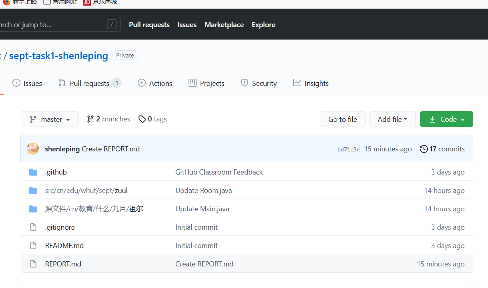
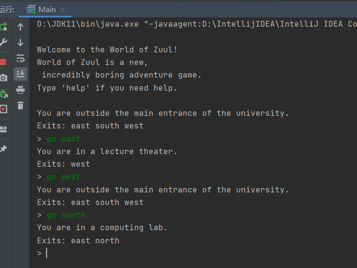

# 软件工程实训任务一：代码规范与标注实验报告

## 任务目的
* 理解软件代码规范的重要性
* 理解代码变化对软件质量带来的影响
* 掌握基于Git的个人代码版本维护方法
* 掌握MarkDown文件编写方法

## 任务内容
* 阅读、理解和标注样例代码
* 分析和学习代码质量特征、设计方法和编程风格
* 运用所学方法，对开源代码进行标注
* 对样例工程进行简单功能扩充和维护

## 任务要求
1. 阅读和描述样例工程
    * fork样例工程，并clone到本地仓库；
      
   * 在本地开发环境上运行样例工程，理解样例工程的代码逻辑；
     
   * 精读样例工程软件代码，描述代码结构及部件组成；
     1 主函数运行，创建一个Game类对象game，此时运行createRooms函数 ，调用play方法
     2 play运行printWelcome类，由parser类记录
     3 运行parser类的getCommand方法，将用户输入的字符串命令传入变量，并将字符串中的两个单词提取出两个变量中
     4 根据word1是否为空，选择将值传入不同的方法
     5 执行processCommand(command)
     6 将第一个单词为help 执行printhelp与showCommands方法，go执行goRoom，quit执行quit方法
   * 以UML图描述样例工程的组成及结构图（类及类之间的关系）
      * 可结合markdown语法和mermaid插件绘制所需图形  
   使用Typora与mermaid插件绘制UML图
   ```mermaid
   classDiagram
   paser <|.. game
   Room <|.. game
   game<|..main
   CommandWords <|.. paser
   Command <|.. paser
   main:+main()
   game : -Parser parser
   game : -Room currentRoom
   game: +Game() 
   game: -void createRooms()
   game:+void play() 
   game:-void printWelcome()
   game:-boolean processCommand()
   game:-void printHelp()
   game:-void goRoom
   class paser{
   -commands:CommandWords
   -reader:char
   +Command getCommand()
   +Parser()
   +void showCommands()
   }
   class CommandWords{
   - String[] validCommands
   +CommandWords()
   +boolean isCommand()
   +void showAll()
   }
   class Command{
   -String commandWord
   -String secondWord
   +Command()
   +String getCommandWord()
   +String getSecondWord()
   +boolean isUnknown()
   +boolean hasSecondWord()
   }
   class Room{
   -description:char
   -exits:char
   +void setExit
   +String getShortDescription()
   +String getLongDescription()
   -String getExitString()
   +Room getExit
   }
   
2. 标注样例工程中的代码
    * 基于javadoc规范标注代码，对包、类、方法、代码片段、参数和语句等代码层次进行注释（可参考Game类的标注样例）；
    * 注释后的代码提交到本地代码库后，同步推送到远程代码仓库；
    * 可参考ESLint、github/super-linter等开发插件了解关于代码规范的相关知识；

3. 扩充和维护样例工程
    * 对样例代码中的功能设计进行分析，找出若干设计缺陷和改进点，并进行修正或扩充，并集成到工程代码中；

     将Game中ProcessCommand()中的if else结构改为switch case结构
> switch (commandWord){
      case "help":
      printHelp();
      break;
      case "go":
      goRoom(command);
      break;
      case "quit":
      wantToQuit=quit(command);
      break;
      default:System.out.println("I don't know what you mean...");
      }
    >